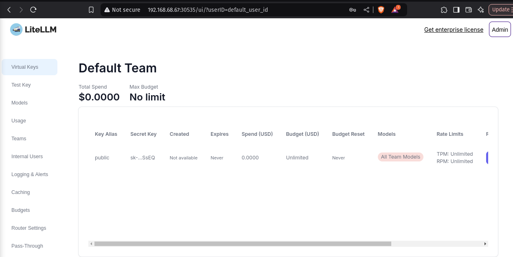
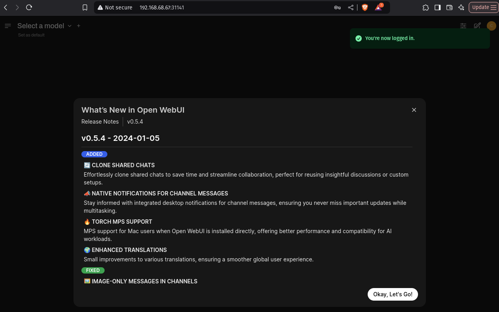
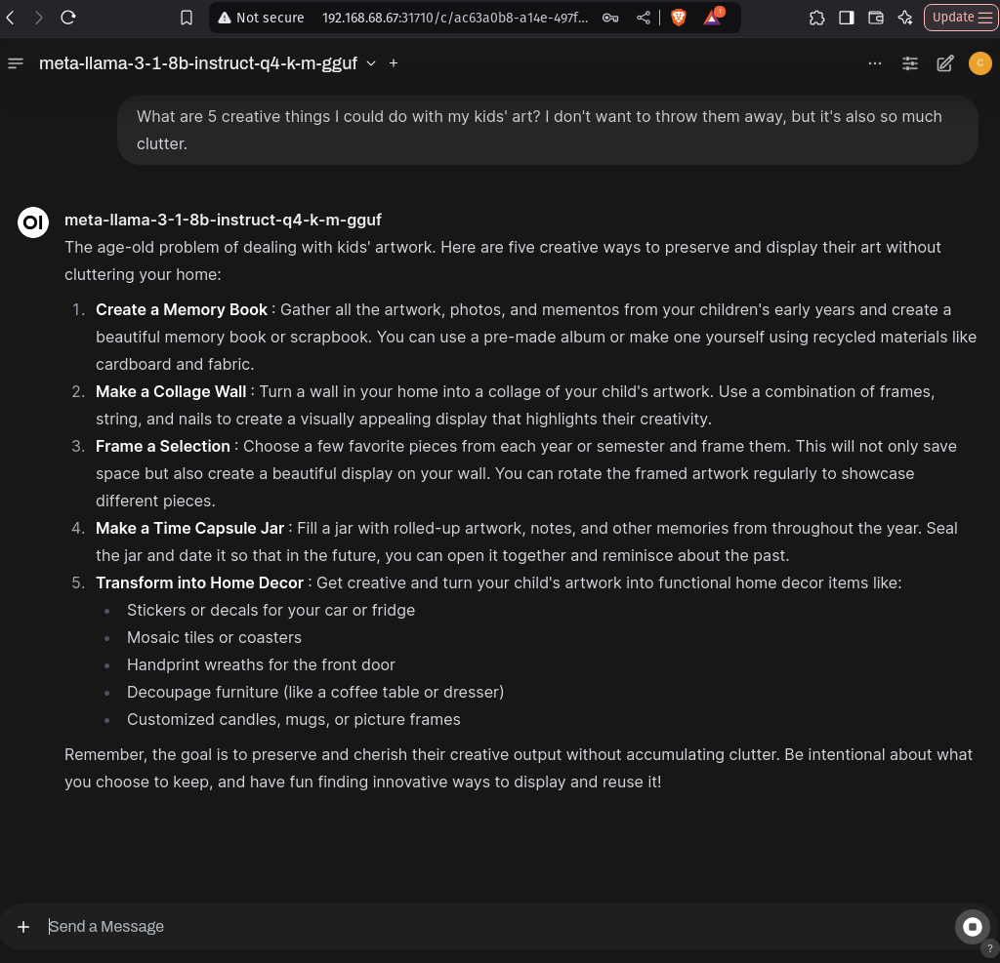

---
tags:
  - private
  - self-hosted
  - LLM pool
  - llamacpp
  - openai-like api
  - chatgpt-like ui
---

# Self-hosted LLM pools

### ⭐⭐⭐ Kalavai and our LLM pools are open source, and therefore free to use in both commercial and non-commercial purposes. If you find it useful, consider supporting us by [staring our GitHub project](https://github.com/kalavai-net/kalavai-client), joining our [discord channel](https://discord.gg/HJ8FNapQ), follow our [Substack](https://kalavainet.substack.com/) and give us a [review on Product Hunt](https://www.producthunt.com/products/kalavai/reviews/new).

Ideal for AI teams that want to supercharge their resources without opening it to the public.

For easy-mode LLM pools, check out our [Public LLM pool](./public_llm_pool.md), which comes with managed LiteLLM API and OpenWebUI playground for all models.

This guide will show you how to start a **self-hosted LLM pool** with your own hardware, configure it with a **single API and UI Playground** for all your models and **deploy and access** a Llama 3.1 8B instance.


## What you'll achieve

1. Create a local pool
2. Configure unified LLM interface
3. Deploy a llamacpp model
4. Access model via code and UI

### Pre-requisites

- [Install kalavai CLI](getting_started.md#getting-started) on every machine
- Check out our [compatibility matrix](https://github.com/kalavai-net/kalavai-client?tab=readme-ov-file#compatibility-matrix) for supported hardware and OS


## 1. Createa a local pool

All you need to get started is one or more computers that can see each other (i.e. within the same network), and you are good to go.

### A. Start a seed node

A seed node is the machine you use to start the LLM pool. Simply use the CLI to start your seed node. If your node has more than one IP available, choose the one that will be visible by the worker nodes:

```bash
$ kalavai pool start private-llm-pool

Scanning for valid IPs...                                                         cli.py:493
0) 192.168.68.67
1) 10.0.3.1
2) 172.17.0.1

--> Select IP to advertise the node (needs to be visible to other nodes): 0
Using 192.168.68.67 address for server                                            cli.py:495
Installing cluster seed                                                           cli.py:515
Install dependencies...                                                           cli.py:537
Your cluster is ready! Grow your cluster by sharing your joining token with others. Run kalavai pool token to generate one.                                             
Waiting for core services to be ready, may take a few minutes...                  cli.py:567
Initialise user workspace...                                                      cli.py:571
Deployed pool config!                                                             cli.py:226
Workspace creation (ignore already created warnings): {'status': 'success'} 
```

Now you are ready to add worker nodes to this seed. To do so, generate a joining token:
```bash
$ kalavai pool token <access mode>

Join token: <token>
```

Access modes determine the level of access new nodes will have over the pool:
- `--admin`: Same level of access than the seed node, including generating new joining tokens and deleting nodes.
- `--user`: Can deploy jobs, but lacks admin access over nodes.
- `--worker`: Workers carry on jobs, but cannot deploy their own jobs.

To give user access:
```bash
kalavai pool token --user
```


### B. Add worker nodes

Increase the power of your LLM pool by inviting others to join. You can do this at any stage, even after deploying models.

Copy the joining token generated in the seed node. On each worker node, run:

```bash
$ kalavai pool join <token>

Token format is correct                                                           cli.py:643
Scanning for valid IPs...                                                         cli.py:724
0) 192.168.68.66
1) 172.17.0.1
--> Select IP to advertise the node (needs to be visible to other nodes): 0

Using 192.168.68.66 address for worker                                            cli.py:726
Connecting to private-llm-pool @ 192.168.68.67 (this may take a few minutes)...  cli.py:729
Workspace creation (ignore already created warnings): {'status': 'success'}       cli.py:200
You are connected to private-llm-pool 
```

### C. Check resources available across the pool

To see the available resources across the pool, you can use:

```bash
$ kalavai pool resources

┏━━━━━━━━━━━┳━━━━━━━━━┳━━━━━━━┳━━━━━━━━━━━━━━┳━━━━━━━━━━━━━━━━┓
┃           ┃ n_nodes ┃ cpu   ┃ memory       ┃ nvidia.com/gpu ┃
┡━━━━━━━━━━━╇━━━━━━━━━╇━━━━━━━╇━━━━━━━━━━━━━━╇━━━━━━━━━━━━━━━━┩
│ Available │ 2       │ 45.46 │ 150877769728 │ 1              │
├───────────┼─────────┼───────┼──────────────┼────────────────┤
│ Total     │ 2       │ 52    │ 151561441280 │ 1              │
└───────────┴─────────┴───────┴──────────────┴────────────────┘

$ kalavai pool gpus

┏━━━━━━━━┳━━━━━━━┳━━━━━━━━━━━━━━━━━━━━━━━━━━━━━━━━━━━━━━━━━━━━━━━━━━━━━━┳━━━━━━━━━━━┳━━━━━━━┓
┃ Node   ┃ Ready ┃ GPU(s)                                               ┃ Available ┃ Total ┃
┡━━━━━━━━╇━━━━━━━╇━━━━━━━━━━━━━━━━━━━━━━━━━━━━━━━━━━━━━━━━━━━━━━━━━━━━━━╇━━━━━━━━━━━╇━━━━━━━┩
│ pop-os │ True  │ NVIDIA-NVIDIA GeForce RTX 3050 Ti Laptop GPU (4 GBs) │ 1         │ 1     │
└────────┴───────┴──────────────────────────────────────────────────────┴───────────┴───────┘
```

**_Note: the following commands can be executed on any machine that is part of the pool, provided you have used `--admin` or `--user` access modes to generate the token. If you have used `--worker`, deployments are only allowed in the seed node._**


## 2. (Optional) Configure unified LLM interface

This is an optional but highly recommended step that will help automatically register any model deployment centrally, so you can interact with any model through a single OpenAI-like API endpoint, or if you prefer UI testing, a single ChatGPT-like UI playground.

We'll use our own template jobs for the task, so no code is required. Both jobs will require a permanent storage, which can be created easily in an LLM pool using `kalavai storage create <db name> <size in GB>`. Create two storage spaces:

```bash
$ kalavai storage create litellm-db 1

Storage litellm-db (1Gi) created

$ kalavai storage create webui-db 2

Storage webui-db (2Gi) created
```

### Unified OpenAI-like API

Model templates deployed in LLM pools have an optional key parameter to register themselves with a LiteLLM instance. [LiteLLM](https://docs.litellm.ai/docs/) is a powerful API that unifies all of your models into a single API, making developing apps with LLMs easier and more flexible.

Our [LiteLLM](https://github.com/kalavai-net/kalavai-client/tree/main/templates/litellm) template automates the deployment of the API across a pool, database included. To deploy it, simply:

```bash
kalavai job defaults litellm > values.yaml 
# Edit values.yaml
#   set 'db_storage' value to "litellm-db"
kalavai job run litellm --values values.yaml
```

`kalavai job run` will prompt for what GPUs to use or avoid (if there are any available in the pool). This has no effect on jobs that do not use GPUs, as is the case for the ones deployed in this guide.

Once the deployment is complete, you can identify the endpoint:

```bash
$ kalavai job list

┏━━━━━━━━━┳━━━━━━━━━━━━┳━━━━━━━━━━┳━━━━━━━━━━━━━━━━━━━━━━━━━━━━━━━━━━━━━━━━━━━━━┓
┃ Owner   ┃ Deployment ┃ Workers  ┃ Endpoint                                    ┃
┡━━━━━━━━━╇━━━━━━━━━━━━╇━━━━━━━━━━╇━━━━━━━━━━━━━━━━━━━━━━━━━━━━━━━━━━━━━━━━━━━━━┩
│ default │ litellm    │ Ready: 2 │ http://192.168.68.67:30535 (mapped to 4000) │
└─────────┴────────────┴──────────┴─────────────────────────────────────────────┘
```

You will need a virtual key to register models with LiteLLM. For testing you can use the master key defined in your values.yaml under `master_key`, but it is recommended to generate a virtual one that does not have privilege access. The easiest way of doing so is via the admin UI, under http://192.168.68.67:30535/ui (see more details [here](https://docs.litellm.ai/docs/proxy/virtual_keys)).

```
Example virtual key: sk-rDCm0Vd5hDOigaNbQSSsEQ
```




### Unified UI Playground

[OpenWebUI](https://docs.openwebui.com/) is a great ChatGPT-like app that helps testing LLMs. Our [WebUI template](https://github.com/kalavai-net/kalavai-client/tree/main/templates/webui) manages the deployment of an OpenWebUI instance in your LLM pool, and links it to your LiteLLM instance, so any models deployed and registered with LiteLLM automatically appear in the playground.

To deploy:

```bash
kalavai job defaults webui > values.yaml 
# Edit values.yaml
#   set the 'litellm_key' to match your virtual key
#   set 'data_storage' to "webui-db"
kalavai job run webui --values values.yaml
```

Once it's ready, you can access the UI via its advertised endpoint, directly on your browser:

```bash
$ kalavai job list

┏━━━━━━━━━┳━━━━━━━━━━━━┳━━━━━━━━━━┳━━━━━━━━━━━━━━━━━━━━━━━━━━━━━━━━━━━━━━━━━━━━━┓
┃ Owner   ┃ Deployment ┃ Workers  ┃ Endpoint                                    ┃
┡━━━━━━━━━╇━━━━━━━━━━━━╇━━━━━━━━━━╇━━━━━━━━━━━━━━━━━━━━━━━━━━━━━━━━━━━━━━━━━━━━━┩
│ default │ litellm    │ Ready: 2 │ http://192.168.68.67:30535 (mapped to 4000) │
├─────────┼────────────┼──────────┼─────────────────────────────────────────────┤
│ default │ webui-1    │ Ready: 1 │ http://192.168.68.67:31141 (mapped to 8080) │
└─────────┴────────────┴──────────┴─────────────────────────────────────────────┘
```

The first time you login you'll be able to create an admin user. Check the [official documentation](https://docs.openwebui.com/) for more details on the app.




### Check deployment progress

Jobs may take a while to deploy. Check the progress with:

```bash
$ kalavai job list

┏━━━━━━━━━┳━━━━━━━━━━━━┳━━━━━━━━━━━━┳━━━━━━━━━━━━━━━━━━━━━━━━━━━━━━━━━━━━━━━━━━━━━┓
┃ Owner   ┃ Deployment ┃ Workers    ┃ Endpoint                                    ┃
┡━━━━━━━━━╇━━━━━━━━━━━━╇━━━━━━━━━━━━╇━━━━━━━━━━━━━━━━━━━━━━━━━━━━━━━━━━━━━━━━━━━━━┩
│ default │ litellm    │ Ready: 2   │ http://192.168.68.67:30535 (mapped to 4000) │
├─────────┼────────────┼────────────┼─────────────────────────────────────────────┤
│ default │ webui-1    │ Pending: 1 │ http://192.168.68.67:31141 (mapped to 8080) │
└─────────┴────────────┴────────────┴─────────────────────────────────────────────┘
```

In this case, `litellm` has been deployed but `webui-1` is still pending schedule. If a job cannot be scheduled due to lack of resources, consider adding more nodes or reducing the requested resources via the `values.yaml` files.


## 3. Deploy models with compatible frameworks

Using a self-hosted LLM pool is the same as using a public one, with the only difference being access. Your self-hosted LLM pool is private and only those you give a joining token access to can see and use it. 

To deploy a multi-node, multi-GPU vLLM model, check out the [section under Public LLM pools](./public_llm_pool.md#new-vllm-model).

In this section, we'll look into how to deploy a model with another of our supported model engines: [llama.cpp](https://github.com/kalavai-net/kalavai-client/blob/main/templates/llamacpp/README.md)

We provide an [example of template values to deploy Llama 3.1 8B model](https://github.com/kalavai-net/kalavai-client/blob/main/examples/llms/llamacpp-llama-8b.yaml). Copy its content in your machine into a `values.yaml` file. Feel free to modify its values. If you use the default values, the deployment will use the following parameters:

- `litellm_key`: set it to your virtual key to automatically register it with both LiteLLM and OpenWebUI instances.
- `cpu_workers`: the workload will be split across this many workers. Note that a worker is not necessarily a single node, but a set of `cpus` and `memory` RAM (if a node has enough memory and cpus, it will accommodate multiple workers).
- `repo_id`: huggingface model id to deploy
- `model_filename`: for gguf models, often repositories have multiple quantized versions. This parameter indicates the name of the file / version you wish to deploy.

When you are ready, deploy:

```bash
$ kalavai job run llamacpp --values values.yaml

Template /home/carlosfm/.cache/kalavai/templates/llamacpp/template.yaml successfully deployed!                                                                      
Service deployed
```

Once it has been scheduled, check the progress with:

```bash
kalavai job logs meta-llama-3-1-8b-instruct-q4-k-m-gguf

Pod meta-llama-3-1-8b-instruct-q4-k-m-gguf-cpu-0                                 cli.py:1640
           
           -- The C compiler identification is GNU 12.2.0                                   cli.py:1641
           -- The CXX compiler identification is GNU 12.2.0                                            
           -- Detecting C compiler ABI info                                                            
           -- Detecting C compiler ABI info - done                                                     
           -- Check for working C compiler: /usr/bin/cc - skipped                                      

           ...                                            
                                                                                                  
           Pod meta-llama-3-1-8b-instruct-q4-k-m-gguf-cpu-1                                 cli.py:1640
           -- The C compiler identification is GNU 12.2.0                                   cli.py:1641
           -- The CXX compiler identification is GNU 12.2.0                                            
           -- Detecting C compiler ABI info                                                            
           -- Detecting C compiler ABI info - done                                                     
           -- Check for working C compiler: /usr/bin/cc - skipped                                      
           ...                                                      
                                                                                             
           Pod meta-llama-3-1-8b-instruct-q4-k-m-gguf-cpu-2                                 cli.py:1640
           -- The C compiler identification is GNU 12.2.0                                   cli.py:1641
           -- The CXX compiler identification is GNU 12.2.0                                            
           -- Detecting C compiler ABI info                                                            
           -- Detecting C compiler ABI info - done                                                     
           -- Check for working C compiler: /usr/bin/cc - skipped                                      
           ...                                                     
                                                                                                  
           Pod meta-llama-3-1-8b-instruct-q4-k-m-gguf-registrar-0                           cli.py:1640
           Waiting for model service...                                                     cli.py:1641
           Waiting for                                                                                 
           meta-llama-3-1-8b-instruct-q4-k-m-gguf-server-0.meta-llama-3-1-8b-instruct-q4-k-            
           m-gguf:8080...                                                                              
           ...Not ready, backoff                                                                       
           ...Not ready, backoff                                                                       
                                                                                                  
           Pod meta-llama-3-1-8b-instruct-q4-k-m-gguf-server-0                              cli.py:1640
           Collecting llama-cpp-python==0.3.2                                               cli.py:1641
             Downloading llama_cpp_python-0.3.2.tar.gz (65.0 MB)                                       
                ━━━━━━━━━━━━━━━━━━━━━━━━━━━━━━━━━━━━━━━━ 65.0/65.0 MB 24.0 MB/s eta 0:00:00            
             Installing build dependencies: started                                                    
             ...
```

The logs include individual logs for each worker.

## 4. Access your models

Once they are donwloaded and loaded into memory, your models will be readily available both via the LiteLLM API as well as through the UI Playground. Check out our [full guide on how to access deployed models](./public_llm_pool.md#a-use-existing-models) via API and the playground.




## 5. Clean up

Remove models:

```bash
kalavai job delete <name of the model>
```

You can identify the name of the model by listing them with:

```bash
$ kalavai job list

┏━━━━━━━━━┳━━━━━━━━━━━━━━━━━━━━━━━━━━━━━━━━━━━━━━┳━━━━━━━━━━━━┳━━━━━━━━━━━━━━━━━━━━━━━━━━━━━━━━━━━━━━━┓
┃ Owner   ┃ Deployment                           ┃ Workers    ┃ Endpoint                              ┃
┡━━━━━━━━━╇━━━━━━━━━━━━━━━━━━━━━━━━━━━━━━━━━━━━━━╇━━━━━━━━━━━━╇━━━━━━━━━━━━━━━━━━━━━━━━━━━━━━━━━━━━━━━┩
│ default │ litellm                              │ Ready: 2   │ http://192.168.68.67:30535 (mapped to │
│         │                                      │            │ 4000)                                 │
├─────────┼──────────────────────────────────────┼────────────┼───────────────────────────────────────┤
│ default │ meta-llama-3-1-8b-instruct-q4-k-m-gg │ Pending: 5 │ http://192.168.68.67:31645 (mapped to │
│         │ uf                                   │            │ 8080)                                 │
├─────────┼──────────────────────────────────────┼────────────┼───────────────────────────────────────┤
│ default │ webui-1                              │ Ready: 1   │ http://192.168.68.67:31141 (mapped to │
│         │                                      │            │ 8080)                                 │
└─────────┴──────────────────────────────────────┴────────────┴───────────────────────────────────────┘
```

Disconnect a worker node and remove the pool:

```bash
# from a worker node
kalavai pool stop

# from the seed node
kalavai pool stop
```


## 6. What's next?

Enjoy your new supercomputer, check out our [templates](https://github.com/kalavai-net/kalavai-client/tree/main/templates) and [examples](https://github.com/kalavai-net/kalavai-client/tree/main/examples) for more model engines and [keep us posted](https://discord.gg/HJ8FNapQ) on what you achieve!