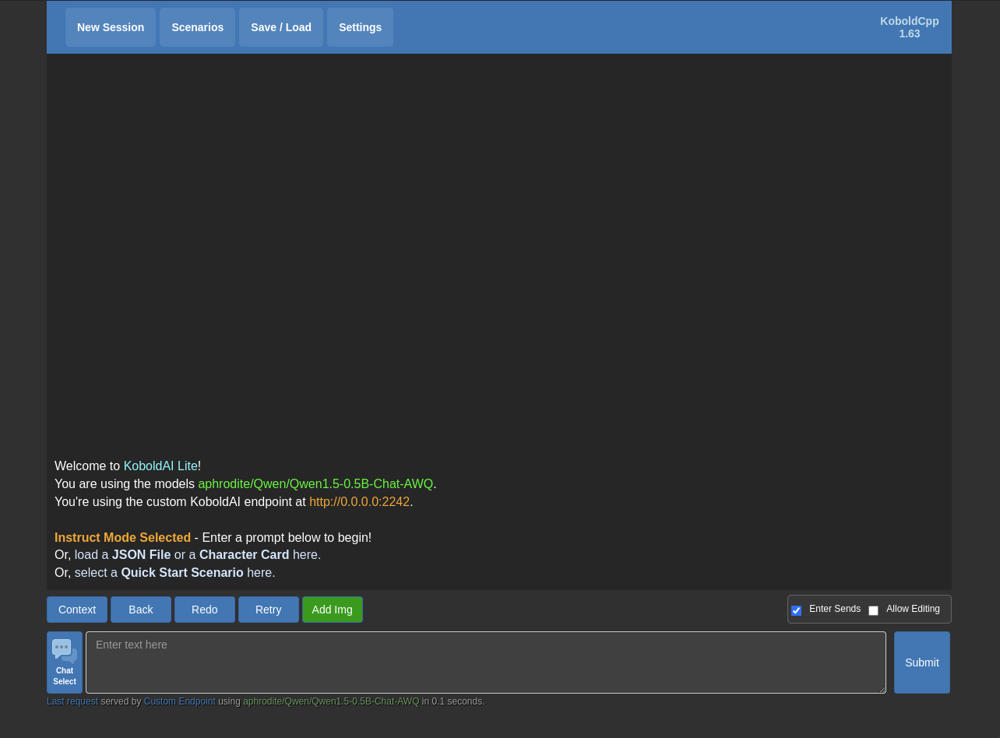

# Deployment of a quantized (GGUF) model with Kalavai

## Example card

**Template**: [aphrodite](../templates/aphrodite/README.md)

**Goal**: deploy a GGUF Large Language Model in your local machine and expose it via an OpenAI compatible API.


## Pre-requisites

- Install [kalavai cli](../README.md#install)
- Setup a [kalavai cluster](../README.md#cluster-quick-start) with 2 machines.
- Your machine should have:
    * 1 NVIDIA GPU with at least 4GB vRAM
    * 8 GB of RAM (configurable below)
    * 4 CPUs (configurable below)

## Getting started

We wish to deploy [Qwen/Qwen1.5-0.5B-Chat-AWQ](https://huggingface.co/Qwen/Qwen1.5-0.5B-Chat-AWQ) on a single GPU. We are going to request a KoboldAI GUI to be deployed with it so we can test it in our browser.


1. Create `values.yaml` file and paste the following:
```yaml
template_values:
- name: deployment_name
  value: qwen-awq-1
  default: aphrodite-1
  description: "Name of the deployment job"

- name: storage
  value: "pool-cache"
  default: "pool-cache"
  description: "Pool storage to use to cache model weights"

- name: replicas
  value: "1"
  default: "1"
  description: "How many replicas to deploy for the model"

- name: num_workers
  value: "1"
  default: "1"
  description: "Workers per deployment (for tensor parallelism)"

- name: repo_id
  value: Qwen/Qwen1.5-0.5B-Chat-AWQ
  default: null
  description: "Huggingface model id to load"

- name: model_filename
  value: "None"
  default: "None"
  description: "Specific model file to use (handy for quantized models such as gguf)"

- name: hf_token
  value: <your token>
  default: null
  description: "Huggingface token, required to load model weights"

- name: cpus
  value: "4"
  default: "4"
  description: "CPUs per single worker (final one = cpus * num_workers)"

- name: gpus
  value: "1"
  default: "1"
  description: "GPUs per single worker (final one = gpus * num_workers)"

- name: gpu_vram
  value: "4000"
  default: "4000"
  description: "vRAM per GPU (total one = num_workers * gpus * gpu_vram)"

- name: memory
  value: "8Gi"
  default: "8Gi"
  description: "RAM memory per single worker (final one = memory * num_workers)"

- name: tensor_parallel_size
  value: "1"
  default: "1"
  description: "Tensor parallelism (use the number of GPUs per node)"

- name: pipeline_parallel_size
  value: "1"
  default: "1"
  description: "Pipeline parallelism (use the number of nodes)"

- name: shmem_size
  value: "4000000000"
  default: "4000000000"
  description: "Size of the shared memory volume"

- name: extra
  value: "--dtype float16 --enforce-eager --launch-kobold-api"
  default: ""
  description: "Extra parameters to pass to the vLLM server. See https://aphrodite.pygmalion.chat/"
```

2. Deploy your aphrodite template:
```bash
kalavai job run aphrodite --values values.yaml
```

3. Wait until it is ready; it may take a few minutes depending on your internet connection. Monitor the deployment until status is `Available`:
```bash
$ kalavai job list

┏━━━━━━━━━━━━━━━━━━━┳━━━━━━━━━━━━━━━━━━━━━━━━━━━━━━━━━━━┳━━━━━━━━━━━━━━━━━━━━━━━━┓
┃ Deployment        ┃ Status                            ┃ Endpoint               ┃
┡━━━━━━━━━━━━━━━━━━━╇━━━━━━━━━━━━━━━━━━━━━━━━━━━━━━━━━━━╇━━━━━━━━━━━━━━━━━━━━━━━━┩
│ qwen-awq-1        │ Available: All replicas are ready │ http://100.8.0.2:31947 │
└───────────────────┴───────────────────────────────────┴────────────────────────┘
```

4. Now you are ready to do inference with the model! Substitute the URL below with the endpoint indicated above:

```bash
curl http://100.8.0.2:31947/v1/completions \
    -H "Content-Type: application/json" \
    -d '{
        "model": "Qwen/Qwen1.5-0.5B-Chat-AWQ",
        "prompt": "I would walk 500",
        "max_tokens": 50,
        "temperature": 0
    }'
```

5. Alternatively, you can do inference in Python:

```python
from openai import OpenAI

# Modify OpenAI's API key and API base to use vLLM's API server.
openai_api_key = "EMPTY"
openai_api_base = "http://100.8.0.2:31947/v1"
client = OpenAI(
    api_key=openai_api_key,
    base_url=openai_api_base,
)
completion = client.completions.create(
    model="Qwen/Qwen1.5-0.5B-Chat-AWQ",
    prompt="I would walk 500")
print("Completion result:", completion)
```

6. A KoboldAI GUI should be available in your browser at the address `http://100.8.0.2:31947`:




## Debug

If you want to inspect what's going on with the openAI server, you can access the full logs of the job (on each node) with:
```bash
kalavai job logs qwen-awq-1
```


## Delete deployment

Once you are done with your model, you can delete the deployment with
```bash
kalavai job delete qwen-awq-1
```
