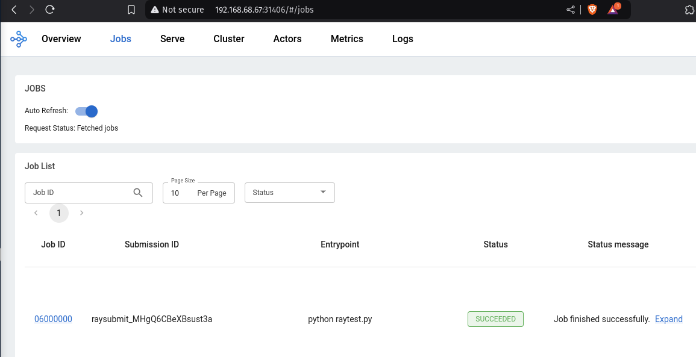

# Deploying a Ray cluster with Kalavai

## Example card

**Goal**: deploy a Ray cluster on your Kalavai cluster.

[Ray](https://docs.ray.io/en/latest/index.html) is a popular open source engine for distributed computing that is widely used in the AI community. You can train, tune and serve models across multiple computers. Kalavai lets you deploy a Ray cluster across any connected worker nodes.

## Pre-requisites

- Install [kalavai cli](../README.md#install)
- Setup a [kalavai cluster](../README.md#cluster-quick-start) with 2 machines.
- Your machines should have:
    * 1 NVIDIA GPU
    * 8 GB of RAM (configurable below)
    * 4 CPUs (configurable below)

## Getting started

We wish to run a piece of python code in distributed machines. For it, we will first create a Ray cluster instance with 2 workers, then we'll deploy our code and see it run in multiple machines.


1. Start a Ray cluster with a yaml configuration file. One is [provided as example](./data/ray_cluster_spec.yaml), which has the following characteristics:
- 1 head node (2 CPUs, 4GB RAM)
- 2 worker nodes (2 CPUs, 4GB RAM, 1 GPU each)


```bash
kalavai ray create examples/data/ray_cluster_spec.yaml
```

2. Monitor the state of your ray cluster. It may take a few minutes to be up and running:
```bash
$ kalavai ray list

┏━━━━━━━━━━━━━┳━━━━━━━━━━━━━━━━━━━━━━━━┳━━━━━━┳━━━━━━┳━━━━━━━━┳━━━━━━━━━━━━━━━━━━━━━━━━━━━━━━━━━━━━━━━┓
┃ Name        ┃ Status                 ┃ CPUs ┃ GPUs ┃ Memory ┃ Endpoints
┡━━━━━━━━━━━━━╇━━━━━━━━━━━━━━━━━━━━━━━━╇━━━━━━╇━━━━━━╇━━━━━━━━╇━━━━━━━━━━━━━━━━━━━━━━━━━━━━━━━━━━━━━━━┩
│ gpu-cluster │ Head ready             │ 4    │ 1    │ 8Gi    │ client: http://192.168.68.67:31043    │
│             │ Workers: 1 ready (1/2) │      │      │        │ dashboard: http://192.168.68.67:31406 │
│             │                        │      │      │        │ metrics: http://192.168.68.67:31424   │
│             │                        │      │      │        │ redis: http://192.168.68.67:31455     │
│             │                        │      │      │        │ serve: http://192.168.68.67:31244     │
└─────────────┴────────────────────────┴──────┴──────┴────────┴───────────────────────────────────────┘
```

4. Now your ray cluster is ready and can be accessed in several ways via endpoints; the most relevant are:
- `dashboard` --> You can open the dashboard URL from your browser. This gives access to the main cluster UI from Ray. You can also submit jobs to this URL.
- `client` --> this is the URL you should use when connecting to the cluster in code. In Python:

```python
import ray
ray.init("http://192.168.68.67:31043")
```

5. We are ready to send code to our ray cluster. We need to create a python script, put it in its own working folder, then submit it to our cluster.

Create a `raytest.py` script and place it under `raytest/` folder:
```python
import ray

ray.init()

@ray.remote
def f(x):
    return x * x

futures = [f.remote(i) for i in range(2)]
print(ray.get(futures)) # [0, 1]
```

The folder structure should look as follows:

```
raytest/
|
|---raytest.py
```

Now install ray CLI with a matching version and submit your job. Use the dashboard endpoint in your Ray cluster as `address`.

```bash
pip install ray[default]==2.32.0
ray job submit --working-dir ./raytest --address http://192.168.68.67:31406 -- python raytest.py
```

You should see the output in the console, and can also inspect the job progress by visiting the browser dashboard at `http://192.168.68.67:31406`, under `Jobs`




## Next steps

A Ray cluster in Kalavai behaves in much the same way than Ray in other environments. We encourage to check out [Ray's official documentation](https://docs.ray.io/en/latest/index.html) for more details. 


## Debug

If you want to inspect the parameters of any ray cluster:
```bash
kalavai ray describe <name of the cluster>
```


## Delete deployment

Once you are done with your ray cluster, you can delete it if no longer required:
```bash
kalavai ray delete gpu-cluster
```
